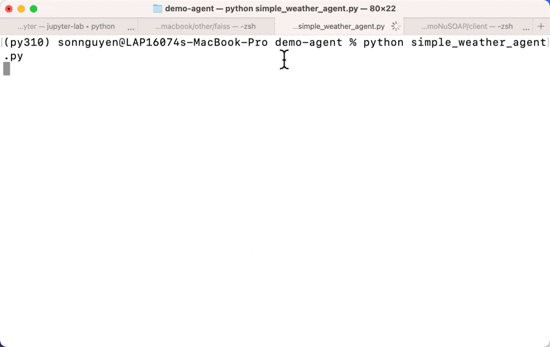

# Demo Simple Agent

Dự án demo AI Agent sử dụng OpenAI Chat Completions với tool calling để thực thi các chức năng Python.
Bao gồm một CLI chat đơn giản và các tool minh họa: thời tiết, giá cổ phiếu, thông tin sinh viên, tính toán.

## Tính năng

- **Thời tiết**: Lấy thời tiết hiện tại theo địa điểm và đơn vị nhiệt độ
- **Giá cổ phiếu**: Tra cứu giá theo mã cổ phiếu
- **Thông tin sinh viên**: Truy vấn thông tin theo mã số sinh viên
- **Tính toán**: Thực hiện các phép tính cơ bản (+, -, *, /)
- **Lịch sử hội thoại**: Lưu ngắn gọn lịch sử giữa người dùng và agent


## Demo



## Cấu trúc dự án

- `demo_simple_agent.py`: CLI Agent chat, gọi OpenAI và tự động gọi tool khi cần
- `tools.py`: Cài đặt các tool (`get_current_weather`, `get_stock_price`, `get_student_info`, `calculate`) và `tool_descriptions`
- `utils.py`: Tiện ích in màu (`cprint`) và `function_to_json` để sinh JSON schema từ hàm Python
- `.env.sample`: Mẫu cấu hình biến môi trường

## Yêu cầu & Cài đặt

- Python 3.9+
- Cài đặt thư viện:

```bash
pip install openai python-dotenv
```

## Cấu hình

Sao chép file mẫu và đặt API key:

```bash
cp .env.sample .env
```

Trong file `.env`, thêm dòng:

```env
OPENAI_API_KEY=your_openai_api_key
```

## Chạy demo CLI

```bash
python demo_agent.py
```

Ví dụ bạn có thể hỏi:

- "Thời tiết ở Tokyo theo độ C"
- "Giá cổ phiếu VCB"
- "Tính 12 / 3"
- "Thông tin sinh viên 123456"
- "So sánh giá cổ phiếu Vietcombank và apple"

## Test nhanh các tool

```bash
python tools.py
```

Script sẽ in ra JSON schema sinh tự động cho từng hàm, và chạy thử một vài lời gọi mẫu.

## Ghi chú

- Mặc định model đang dùng là `gpt-4o-mini` (xem `demo_agent.py`), bạn có thể đổi model tùy nhu cầu.
- Định nghĩa schema các tool được khai báo trong `tools.py` thông qua danh sách `tool_descriptions`.
